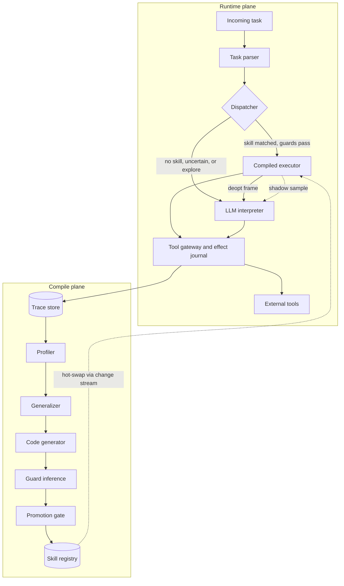
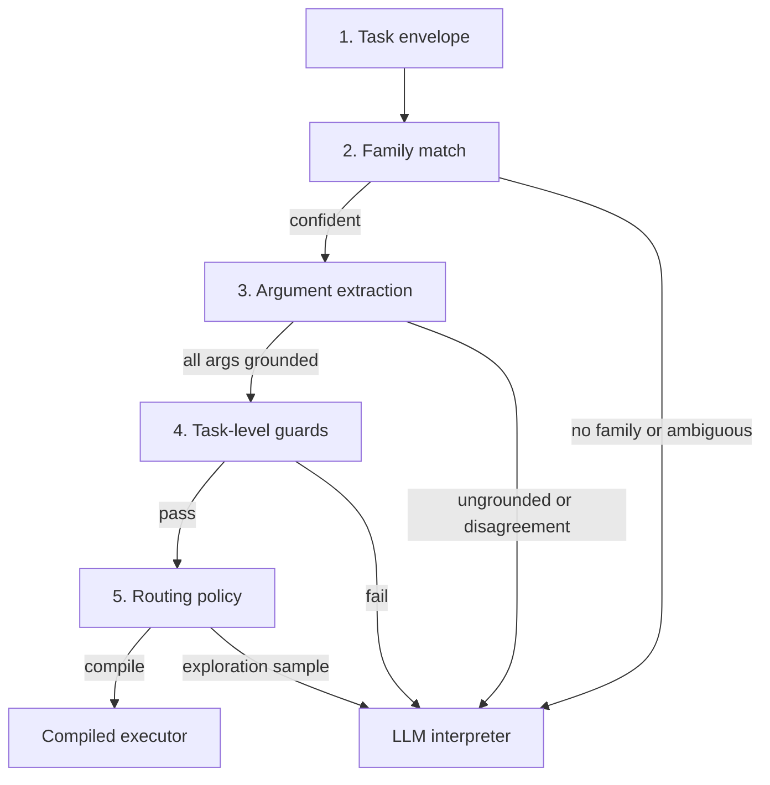
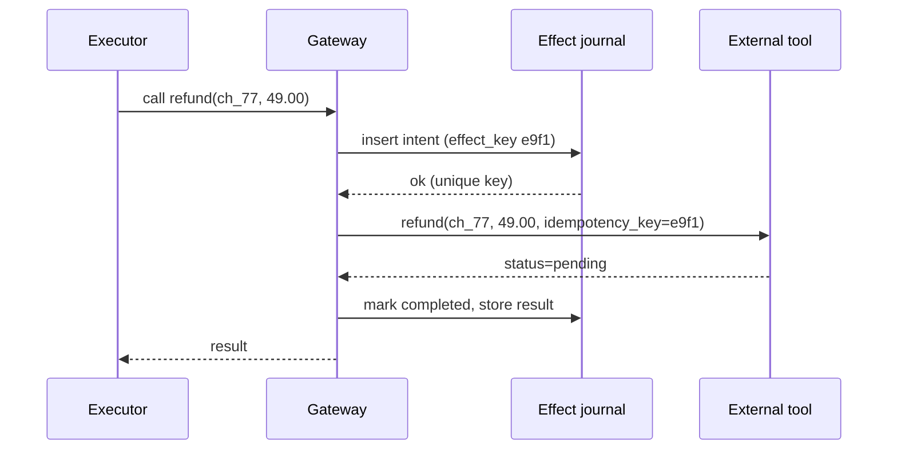
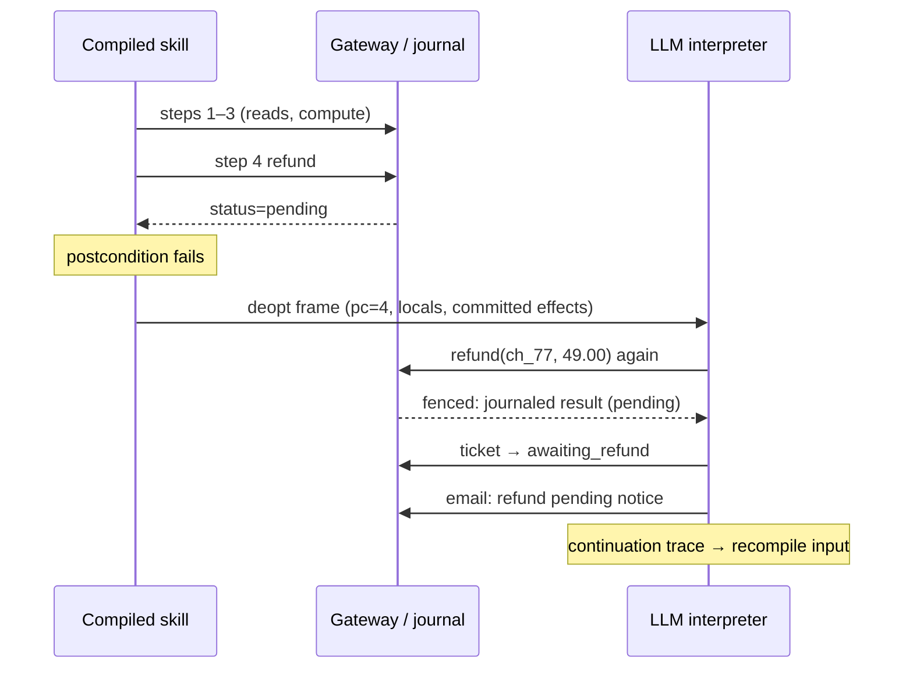
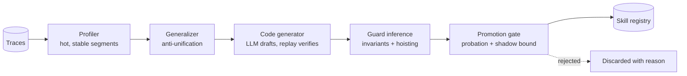
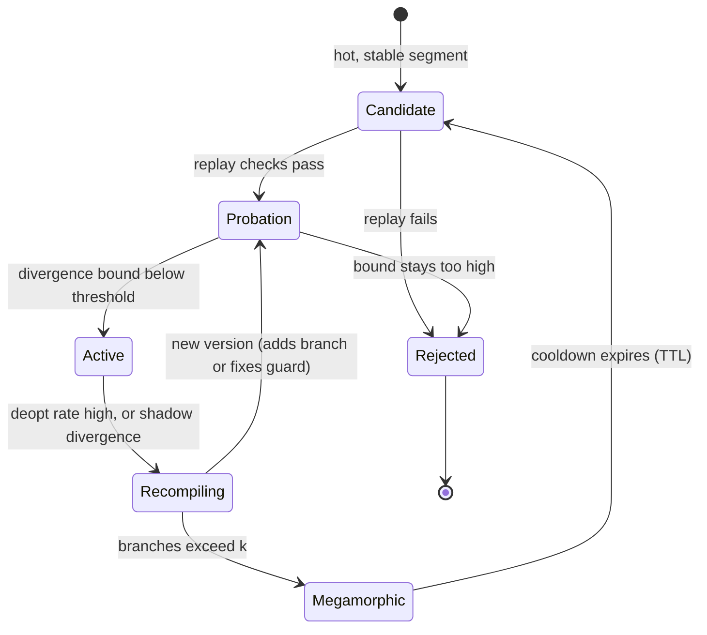
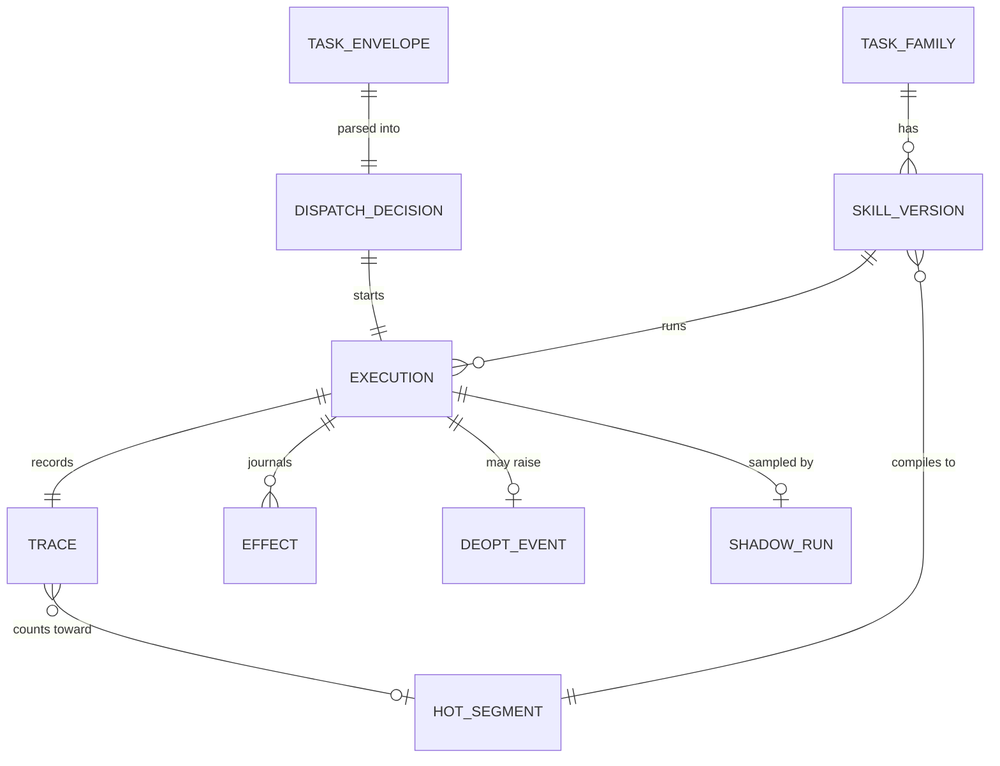
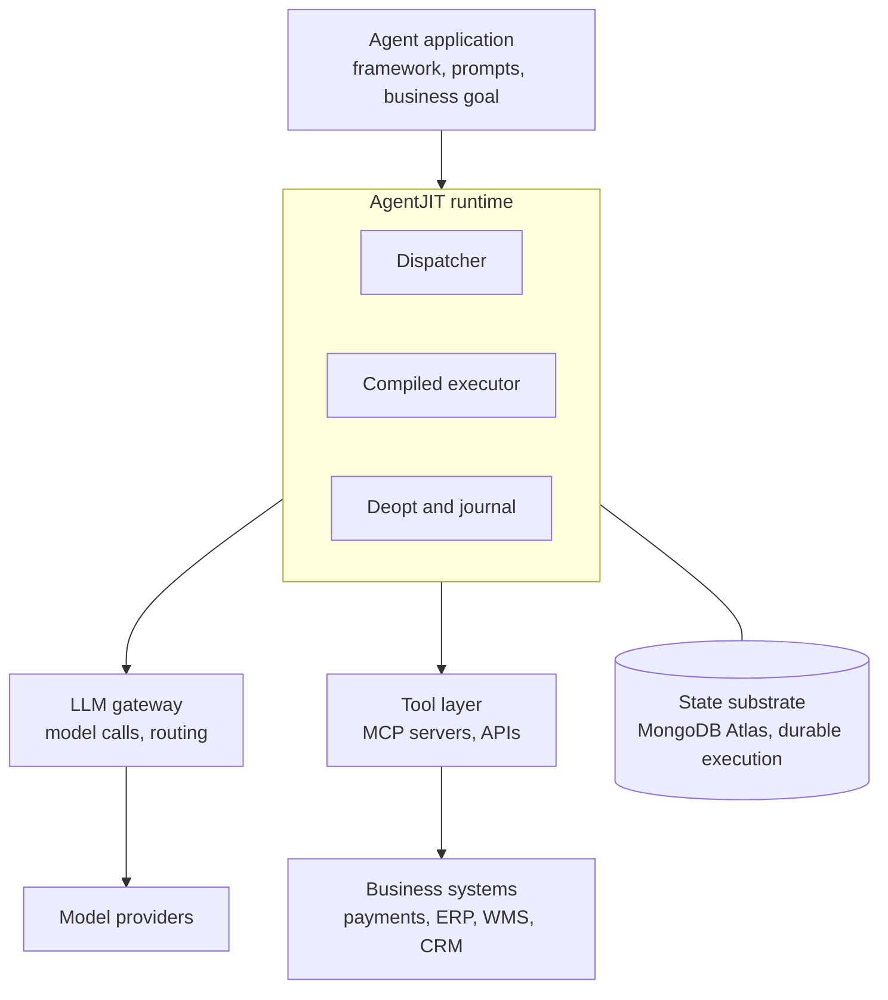

# AgentJIT

### A tracing JIT compiler for LLM agents, with safe deoptimization across real-world side effects

**Hackathon:** MongoDB "Harness Engineering & Model Wrangling"
**Problem statement:** Recursive Harnessing — a self-improving agent harness that automatically evolves its own runtime behavior

---

## Table of contents

1. [Summary](#1-summary)
2. [The problem](#2-the-problem)
3. [Core idea: agents as interpreted programs](#3-core-idea-agents-as-interpreted-programs)
4. [Design principles](#4-design-principles)
5. [Positioning: prior art and what is actually new](#5-positioning-prior-art-and-what-is-actually-new)
6. [System architecture overview](#6-system-architecture-overview)
7. [Runtime plane](#7-runtime-plane)
8. [Compile plane](#8-compile-plane)
9. [Skill lifecycle](#9-skill-lifecycle)
10. [Data model on MongoDB Atlas](#10-data-model-on-mongodb-atlas)
11. [End-to-end walkthrough: refund processing](#11-end-to-end-walkthrough-refund-processing)
12. [Real-world examples](#12-real-world-examples)
13. [Where AgentJIT sits in a real stack](#13-where-agentjit-sits-in-a-real-stack)
14. [Evaluation plan](#14-evaluation-plan)
15. [Risks, limits, and open problems](#15-risks-limits-and-open-problems)
16. [Hackathon plan](#16-hackathon-plan)
17. [Glossary](#17-glossary)
18. [References and prior art](#18-references-and-prior-art)

---

## 1. Summary

**One-sentence contribution.** Recurring agent trace segments are compiled into code guarded by invariants inferred from their source traces, and a guard failure triggers on-stack deoptimization that hands journaled partial state back to the LLM to continue without re-executing side effects.

**Elevator pitch.** Production agents pay full LLM cost and latency for the thousandth identical task. AgentJIT watches an agent work, notices which task paths are frequent and stable, and compiles them into ordinary guarded code. When the world changes and a guard fails, control returns to the LLM mid-task, with full knowledge of what has already happened, so nothing is refunded, emailed, or booked twice. Agents get cheaper, faster, and more consistent the longer they run, and every compiled behavior is readable, versioned, and auditable.

**How it answers the hackathon problem statement.** The harness changes its own execution strategy (interpreted vs compiled), its own tool sequences (compiled skills), its own guardrails (inferred guards), and its own dispatch policy, driven by hard signals: verified task success, cost, latency, deopt rate, and a statistical bound on silent errors. Every change is versioned, tested before promotion, and reversible.

---

## 2. The problem

**Cost and latency scale linearly with volume.** An agent handling 10,000 refund requests a day reasons from scratch 10,000 times, even though most requests follow the same few paths. Nothing the agent learns makes the next run cheaper.

**Existing reuse mechanisms are unsafe or shallow.**

| Mechanism | What it does | What goes wrong |
|---|---|---|
| Response / semantic caching | Reuses an answer for a similar input | No notion of validity; silently wrong when inputs differ in ways the similarity metric misses |
| Plan or workflow caching | Replays a previous tool sequence | No guards; no defined behavior when the replay stops fitting |
| Skill libraries | Stores reusable code or procedures | No guard semantics, no deoptimization, no lifecycle; fails silently when the world changes |
| Hand-built automation (RPA, scripts) | Engineers script the common path | Expensive to build, brittle, and breaks silently when upstream systems change |

**Side effects make fallback hard.** When compiled code discovers mid-task that its assumptions are wrong, the obvious recovery is to restart the task in the LLM. But if the code already issued a refund, sent an email, or bought a shipping label, restarting repeats that action. Safe fallback across irreversible actions is the unsolved core of the problem.

**Nobody measures silent errors.** A shortcut that passes every check it knows about can still be wrong. Without an explicit, statistically grounded estimate of that error rate, a system that "self-improves" by taking shortcuts is just accumulating hidden risk.

---

## 3. Core idea: agents as interpreted programs

A JavaScript engine starts by interpreting code, profiles which paths run hot, compiles them with guards (type and shape checks), and deoptimizes back to the interpreter when a guard fails. AgentJIT applies the same discipline to agents.

| JIT compiler concept | AgentJIT equivalent |
|---|---|
| Interpreter | LLM agent loop choosing each tool call |
| Hot-loop counters | Trace-signature counters per task family |
| Trace recording | Event-sourced traces with data provenance |
| Compiled trace | Skill: generated code with typed LLM "holes" |
| Type / shape guards | Invariants inferred from observed trace values |
| Deoptimization / on-stack replacement (OSR) | Frame handoff so the LLM resumes mid-task |
| Monomorphic → polymorphic → megamorphic inline caches | One guarded path → up to k paths → give up and stay interpreted |
| **No equivalent in JITs** | **Side-effect journal and fencing** |

The last row is the contribution. A JIT can always deoptimize safely because the interpreter can recompute anything. An agent that has already moved money cannot. Most of the architecture exists to make deoptimization safe when real-world effects have already happened.

### Two execution tiers

AgentJIT uses exactly two tiers:

- **Interpreted:** the full LLM agent loop.
- **Compiled:** a guarded skill, which is code that may contain zero or more typed LLM holes.

Earlier drafts had four tiers. Two were removed deliberately:

| Removed tier | Why |
|---|---|
| "LLM with a retrieved skill as a hint" | No guards, no postconditions, nothing to deoptimize from. It is retrieval-augmented prompting and adds no execution semantics. |
| "Pure deterministic" as a separate tier | A pure skill is just a compiled skill with zero holes. The number of holes is a property of a skill, not a separate mode. |

Two tiers means exactly one transition to get right: compiled → interpreted, via deoptimization. Holes form a spectrum inside the compiled tier, and recompilation can shrink them over time (for example, an email body that turns out to be templated becomes a parameterized string instead of an LLM call).

---

## 4. Design principles

1. **The LLM is never trusted to certify its own output.** It may draft code; replay equivalence decides whether the code is accepted. It may extract arguments; grounding and agreement checks decide whether they are used.
2. **Every uncertainty routes to the interpreter.** Parsing failures, ambiguous families, ungrounded arguments, and failed guards all fall back to full LLM reasoning. The system degrades to "a normal agent," never to an error.
3. **All side effects pass through one gateway.** The journal is only correct if nothing can reach the outside world around it.
4. **Guards prefer to be too tight.** An over-specific guard causes an unnecessary deopt, which costs money but is safe. An over-general guard lets code run where it was never validated, which is unsafe and silent. Inference is biased toward tight invariants, loosened by evidence over time.
5. **Hoist every guard that can be hoisted.** Checks whose inputs are available before the first irreversible step are moved in front of it, so most deopts happen where nothing needs to be undone.
6. **Silent error is a measured quantity.** Every active skill carries a confidence bound on its disagreement rate with the interpreter, maintained by continuous shadow sampling that never drops to zero.
7. **Knowing when not to compile is a feature.** Unstable task families are detected and left interpreted.
8. **Compiled behavior is readable.** Every skill is versioned code with explicit guards, each guard recording how much evidence supports it.

---

## 5. Positioning: prior art and what is actually new

### Closest existing work

| Area | Examples | Relationship |
|---|---|---|
| Trace-based JIT compilation | TraceMonkey, PyPy, HotSpot, V8 | Source of the execution semantics (profiling, guards, deopt, OSR, inline-cache states) |
| Dynamic invariant detection | Daikon | Source of the guard-inference method |
| Anti-unification | Plotkin's least general generalization | Source of the trace-generalization method |
| Agent skill libraries | Voyager, LLMs as Tool Makers (LATM), Agent Workflow Memory | Reuse learned behavior, but without guards, deopt, or lifecycle |
| Semantic / plan caching | Various LLM gateways and caching layers | Reuse at the call or plan level, with no validity semantics |
| Durable execution | Temporal, Restate, Inngest | Journaling and exactly-once side effects; AgentJIT should build on these in production |
| RPA / workflow automation | UiPath, n8n, Zapier | What compiled skills resemble; the difference is where the code comes from and what happens when it breaks |
| Straight-through processing (banking ops) | Payment and trade operations | The same business pattern (automate the common path, route exceptions), done by hand |

### What is combination, and what is new

**Combination (borrowed, not claimed as novel):** profiling, trace recording, codegen from examples, invariant inference, caching, journaling.

**New (the claimed contribution):**

1. **Deoptimization across committed real-world side effects**, via a materialized deopt frame plus a journal-backed gateway that fences repeated effects when the LLM resumes.
2. **Guard hoisting against a point of no return**, which uses effect classes to minimize the number of deopts that happen after irreversible actions.
3. **Statistically bounded silent-error rates** for compiled agent behavior, via differential shadow testing against the interpreter.
4. **Inline-cache lifecycle for agent behavior**, including automatic detection of task families that should never be compiled.

### What must be true for this to be infrastructure rather than an application

- Cost savings must survive after paying for shadow testing and parsing.
- The compiled path's undetected-error rate must be measured and bounded, not assumed.
- On-stack deopt must beat restart-from-scratch on both cost and correctness for multi-step, side-effecting tasks. Without side effects, OSR is unnecessary and the system reduces to a cache.

---

## 6. System architecture overview

AgentJIT has two planes.

- **Runtime plane:** serves live tasks. Parses and dispatches each task, runs compiled skills or the LLM interpreter, journals every side effect, handles deoptimization, and samples compiled runs for shadow testing.
- **Compile plane:** runs in the background off the trace store. Profiles traces, generalizes them into templates, generates and verifies code, infers guards, and promotes skills through probation.



**Component responsibilities at a glance**

| Component | Plane | Responsibility | Uses an LLM? |
|---|---|---|---|
| Task parser | Runtime | Envelope, family match, argument extraction, task-level guards | Only as the last extraction rung |
| Dispatcher / routing policy | Runtime | Chooses compiled vs interpreted, exploration, shadow flags | No |
| Compiled executor | Runtime | Runs skill code, evaluates state guards and postconditions | Only inside typed holes |
| LLM interpreter | Runtime | Full agent loop; resumes from deopt frames | Yes |
| Tool gateway and journal | Runtime | Classifies effects, write-ahead journaling, fencing, reconciliation | No |
| Shadow tester | Runtime | Differential runs with stubbed writes | Yes (interpreter side) |
| Profiler | Compile | Counts path signatures, measures stability | No |
| Generalizer | Compile | Anti-unification into templates with parameters and holes | No |
| Code generator | Compile | Drafts skill code; replay harness verifies it | Drafting only |
| Guard inference | Compile | Daikon-style invariants, divergence stumps, hoisting | No |
| Promotion gate | Compile | Probation, confidence bound, activation | No |

---

## 7. Runtime plane

### 7.1 Task parsing and dispatch

Parsing turns a free-form request into a task family, a set of typed, grounded arguments, and a routing decision. The governing rule: **any parsing failure routes to the interpreter.** A task is never rejected because parsing was unsure.



#### Stage 1: Task envelope

The raw request is wrapped in an envelope document (source channel, tenant, raw text, timestamp, and any structured fields that arrived with it, such as `ticket_id` or `customer_email` from a webhook). Anything already structured never needs extraction. The envelope is stored first, so every later decision can point back to exactly what was received.

#### Stage 2: Family match

The task text is embedded and matched with `$vectorSearch` against task-family centroids, pre-filtered by tenant and by families with at least one servable skill (active **or probation**: probation skills must receive traffic, since that traffic is the only source of the shadow runs that can activate them).

| Result | Outcome |
|---|---|
| Top similarity below minimum threshold | Unknown family → interpreter |
| Top two families within a small margin | Ambiguous → interpreter |
| One family clearly wins | Proceed to extraction |

Multi-intent requests ("refund this and change my address") usually appear as small margins, or as clean argument extraction for two families. Version 1 routes these to the interpreter rather than decomposing them.

Embedding similarity is a heuristic and will sometimes pick the wrong family. The design tolerates this only because later stages catch it: a misrouted task usually cannot produce grounded arguments for the wrong skill's signature, or it fails that skill's guards.

#### Stage 3: Argument extraction

Each skill declares a typed input signature. Extraction climbs a ladder and stops at the first rung that succeeds:

1. **Structured field** from the envelope.
2. **Deterministic extractor** learned from past traces (pattern plus surrounding context).
3. **Small model constrained to the signature's JSON schema**, only for parameters still missing.

Deterministic extractors are themselves compiled. In interpreted traces, provenance shows which span of input text became each argument; generalizing those spans across many traces yields a pattern and context. Over time, fewer tasks need the LLM rung.

**Grounding check.** Every extracted value must literally appear in the envelope or be derivable from something that does. A hallucinated but well-formed value (for example, an order ID that appears nowhere in the text) fails grounding and routes the task to the interpreter.

**Agreement check.** A wrong but grounded argument is the one parsing failure nothing downstream catches: if the parser picks the wrong order ID and that order happens to satisfy every guard, the skill acts on the wrong object. Guards verify that the world matches the skill's assumptions; they cannot verify that the skill was pointed at the right object. So for any skill containing an irreversible step, two independent extraction methods must agree. Disagreement routes to the interpreter. The agreeing pair must exist from day one: a hand-written pattern extractor for the key identifier (for example, an `order_id` regex) paired with the schema-constrained model, or a structured field paired with either. Compiled extractors (8.8) later replace the hand-written pattern; they are not a prerequisite for compiled execution.

#### Stage 4: Task-level guards

Guards come in two kinds, depending on what data they need:

| Guard kind | Example | Needs | When checked |
|---|---|---|---|
| Task-level | `reason in {damaged, not_received, wrong_item}` | Only extracted arguments | During parsing, before any tool call |
| State | `order['currency'] in ['USD']`, `len(shipments) == 1` | Data from read tools | Inside compiled execution, in the safe zone before the first irreversible step |

Only task-level guards run during parsing, which keeps parsing fast and side-effect-free.

#### Stage 5: Routing policy

A task that passes everything is eligible for compiled execution. The router still makes three decisions:

1. **Exploration.** A small fraction of eligible tasks go to the interpreter anyway. Without fresh interpreted traces, the profiler cannot notice drift and guards can never be re-derived from current data.
2. **Shadow sampling.** Every run for a skill in probation; a decaying but never-zero rate afterward.
3. **Version selection.** While a recompiled version is in probation, some traffic stays pinned to the previous version for comparison.

#### The dispatch record

Every parse writes one decision document: the audit trail for why a task ran the way it did, and training data for improving the parser (misroutes show up later as deopts at the first guard).

```json
{
  "envelope_id": "env_88213",
  "family": { "id": "refund_request", "similarity": 0.91, "margin": 0.17 },
  "skill": "refund_standard@v3",
  "args": {
    "order_id":       { "value": "A1042",    "method": "pattern",    "grounded": true, "agreement": true },
    "reason":         { "value": "damaged",  "method": "llm_schema", "grounded": true },
    "customer_email": { "value": "ana@x.io", "method": "structured", "grounded": true }
  },
  "task_guards": { "passed": 2, "failed": 0 },
  "route": "compiled",
  "explore": false,
  "shadow": true
}
```

**Parsing cost.** On the happy path: one embedding call, one vector query, a few pattern matches, a few predicate checks, and no LLM generation. The small-model rung and dual-method agreement add cost only where needed. Parsing cost is tracked as its own line item in evaluation.

### 7.2 Compiled executor

The compiled executor runs a skill's code with the typed arguments from parsing. A skill is structured as a sequence of steps, each tagged with the effect class of the tool it calls.

- **Read prefix and state guards.** The executor runs read and pure steps first, then evaluates the hoisted state guards. A failure here is a cheap deopt: nothing has been changed in the world.
- **Typed LLM holes.** Where the skill needs judgment or language (for example, the body of a customer email), it makes a small, bounded LLM call whose output is validated against a schema and simple checks (for example, "must mention the order ID").
- **Residual guards.** Postconditions that depend on the result of a side effect (for example, `refund.status == 'succeeded'`) are checked immediately after that step. A failure here triggers on-stack deoptimization (7.5).
- **All tool calls go through the gateway.** The executor never calls external systems directly.

### 7.3 LLM interpreter

The interpreter is a standard agent loop (any framework). It serves three roles:

1. **Default executor** for anything not compiled, uncertain, or sampled for exploration.
2. **Deopt target** that resumes from a materialized frame (7.5).
3. **Shadow oracle** for differential testing of compiled runs (7.6).

Every interpreted run produces a full trace, which is the raw material for compilation.

### 7.4 Tool gateway and effect journal

The gateway is the single chokepoint between agents (compiled or interpreted) and the outside world. It classifies every tool by effect class and treats each class differently.

| Effect class | Example | On deopt | If the LLM repeats the call |
|---|---|---|---|
| Read | `get_order` | Nothing to do | Allowed (may re-read fresh state) |
| Pure | eligibility calculation | Nothing to do | Allowed |
| Idempotent write | set ticket status | Nothing to do | Allowed |
| Compensable write | reserve inventory, add group member, buy voidable label | Compensating action offered to the LLM | Fenced unless explicitly compensated first |
| Irreversible | refund, send email | Reported in the deopt frame | Fenced: journaled result returned |

#### Write-ahead protocol (every non-read call)

1. Compute an **effect key**: a hash of execution ID, tool, and normalized arguments. The step number is deliberately excluded: a resuming interpreter numbers its steps differently from the compiled skill it continues, and a key containing the step would never match. An execution keeps one execution ID across a deopt.
2. Write an **intent record** with that key (unique index; majority write concern).
3. Make the external call (passing the effect key as an idempotency key where the tool supports one).
4. Write a **completion record** with the result.



#### Uncertain state and reconciliation

A crash between the external call and the completion record leaves an intent with no completion. That effect is marked **uncertain**, and the gateway forces a reconciliation read (for example, `list_refunds(charge_id)`) before anything else in that execution proceeds.

#### Fencing

When the resuming LLM issues a call that matches a completed journal entry, the gateway returns the journaled result instead of executing it again.

Exact effect-key matching is fragile against LLM-issued calls (for example, `49` vs `49.00`, or a differently phrased email). Two defenses:

- **Argument normalization** for formatting differences.
- **Resource fences** for irreversible tools: within one execution, a second irreversible call to the same tool on the same target resource (same `charge_id`, same recipient) is blocked unless the LLM explicitly declares it a distinct action. The declaration is logged.

The journal only protects effects that pass through the gateway. A tool with hidden side effects defeats it; tool registration must declare effect classes honestly.

### 7.5 On-stack deoptimization

When a guard fails mid-skill, the executor materializes a **deopt frame** and hands control to the LLM interpreter, which continues from that point rather than restarting.

#### Deopt frame schema

```json
{
  "skill": "refund_standard@v3",
  "pc": 4,
  "failed_guard": "post: refund.status == 'succeeded'",
  "observed": "pending",
  "locals": { "order_id": "A1042", "charge_id": "ch_77", "amount": 49.00 },
  "committed_effects": [
    { "step": 4, "tool": "payments.refund", "effect_key": "e9f1", "class": "irreversible", "result": { "status": "pending" } }
  ],
  "remaining_goal": "update ticket, notify customer",
  "original_task": "env_88213"
}
```

#### Protocol

1. Guard fails at program counter `pc`.
2. Executor snapshots locals and reads committed effects for this execution from the journal.
3. Frame is written to `deopt_events` and rendered into the interpreter's context: what was done, what was assumed, what was observed instead, and what remains.
4. Interpreter resumes. All its tool calls pass through the gateway, which fences repeats of committed effects.
5. The continuation trace is recorded and linked to the deopt event. It is exactly the evidence the next recompile needs to add a branch.



#### Why restart-from-scratch is wrong

A restart re-reads the order, sees a refund is due, and issues a second refund. With idempotency keys at the provider this might be deduplicated, but many tools have no idempotency support, and the restart also wastes all completed work. On-stack deopt is correct by construction for journaled effects and cheaper in all cases.

### 7.6 Differential shadow testing

Guards catch drift visible in the values they check. They cannot catch drift invisible to those values. Example: the refund window changes from 30 to 14 days; a 20-day-old order still passes `order['days_since_delivery'] <= 30`. Only something that re-reads the policy notices.

**Where the policy lives.** Business policy (refund window, currency rules) is a document in the world, injected into the interpreter's context at the start of every run and read by the verifier at verification time. It is deliberately *not* a tool the compiled skill calls: if the skill read the policy, the window would become a visible guard input and this class of drift would stop being invisible. The shadow interpreter therefore always sees current policy, and the compiled skill never does.

**Mechanism.** A sampled fraction of compiled executions is also run through the interpreter in a sandbox:

- Read tools are allowed (or, better, replayed from a snapshot of the compiled run's reads).
- Write tools are stubbed; intended calls are recorded but not executed.
- The two sets of intended effects are compared after normalization. LLM-hole outputs are compared loosely or excluded.

**Adjudication.** A disagreement means one side is wrong, not necessarily the compiled one. Where a hard verifier exists (tests, schemas, policy checks), it decides. Otherwise the divergence is counted conservatively against the skill and flagged.

**Confidence bound.** Each skill carries a one-sided upper confidence bound on its divergence rate (Clopper–Pearson). Useful rules of thumb:

| Shadow runs | Divergences | 95% one-sided upper bound |
|---|---|---|
| 100 | 0 | ≈ 3.0% |
| 300 | 0 | ≈ 1.0% |
| 180 | 1 | ≈ 2.6% |

(With zero divergences the bound is roughly 3/n, the "rule of three.") To claim a silent-error rate below 1% at 95% confidence, a skill needs about 300 clean shadow runs.

**Sampling schedule.** Probation: every run is shadowed until the bound drops below the promotion threshold. Active: the rate decays but never below a floor (`SHADOW_ACTIVE_MIN_RATE`), because residual sampling is the only defense against invisible drift.

**Activation and demotion use different statistics.** Activation uses the cumulative one-sided upper bound over all of the version's shadow runs. Demotion cannot: after hundreds of clean runs, a handful of new divergences barely moves a cumulative bound, so drift would go undetected for a long time. Instead a skill is demoted when either (a) any divergence is adjudicated against the skill by the hard verifier, which is conclusive evidence on its own, or (b) the one-sided 95% *lower* bound on the divergence rate over the last `SHADOW_WINDOW_RUNS` shadow runs exceeds the active threshold (with a window of 30, five divergences suffice). An *upper* bound over a small window cannot be used: 30 clean runs still give ≈ 9.5%, which would demote every skill.

**Read non-repeatability.** Shadow runs execute slightly later than compiled runs, so live state may differ. Either snapshot read results during the compiled run and replay them to the shadow, or measure and subtract a known false-divergence rate.

---

## 8. Compile plane

The compile plane runs in the background. Its output is a new or updated skill version, which only reaches live traffic after passing the promotion gate.



Only one stage, code generation, uses an LLM, and its output is mechanically verified. Every other stage is deterministic and checkable.

### 8.1 Trace representation

A trace is richer than a chat log. Each step records:

| Field | Purpose |
|---|---|
| `tool`, `args`, `result_digest` | What happened |
| `effect_class` | How the gateway treated it |
| `provenance` | Where each argument value came from (task input, or a field of an earlier step's result) |
| `llm_span` | Which decisions came from model reasoning, and a short summary |
| `cost`, `latency` | For profiling and evaluation |

Provenance is captured cheaply: the gateway matches argument values against values seen earlier in the same trace. It is what makes generalization possible.

```json
{
  "trace_id": "tr_5521",
  "family": "refund_request",
  "mode": "interpreted",
  "signature": "get_order>get_shipments>refund>ticket_update>email_send",
  "steps": [
    { "i": 1, "tool": "get_order", "args": { "order_id": "A1042" },
      "provenance": { "order_id": "input.order_id" }, "effect_class": "read" },
    { "i": 4, "tool": "payments.refund", "args": { "charge_id": "ch_77", "amount": 49.00 },
      "provenance": { "charge_id": "step1.result.charge_id", "amount": "step1.result.total" },
      "effect_class": "irreversible" }
  ],
  "verified_success": true,
  "cost_usd": 0.041
}
```

### 8.2 Profiler

- **Signature:** the tool sequence plus the provenance pattern of each argument (not the concrete values).
- **Hotness:** how often a signature occurs within a family over a sliding window.
- **Stability:** the fraction of the family's recent traces that match the modal signature.
- **Compile trigger:** hotness above a threshold and stability above a threshold (for example, the modal path covers most recent traces).

The profiler is an aggregation over the trace store that maintains a `hot_segments` materialized view (see section 10).

**Hackathon simplification.** Mining arbitrary sub-task segments is the hardest part of the system. Version 1 compiles whole-task traces per family (family assigned by embedding cluster) and skips sub-task segmentation. This loses some coverage but keeps every interesting mechanism.

### 8.3 Generalizer: anti-unification

Given several traces with the same signature, the generalizer computes their least general generalization:

- Positions where values **agree** across traces stay constant.
- Positions where values **differ but have traceable provenance** (from task input or an earlier result) become **parameters**.
- Positions where values **differ with no traceable source** (for example, the prose of a customer email) become **typed LLM holes**.

| Trace | Step 1 | Step 2 | Step 4 | Step 6 |
|---|---|---|---|---|
| Trace A | `get_order(A1042)` | `shipments(A1042)` | `refund(ch77, 49)` | `email(ana@x.io, "…")` |
| Trace B | `get_order(B2210)` | `shipments(B2210)` | `refund(ch91, 120)` | `email(li@y.com, "…")` |
| Trace C | `get_order(C3301)` | `shipments(C3301)` | `refund(ch15, 18.5)` | `email(sam@z.io, "…")` |
| **Template** | `get_order($o)` | `shipments($o)` | `refund($c, $a)` | `email($e, ?body)` |

Compilation is therefore partial rather than all-or-nothing: code with small, bounded, schema-checked LLM calls where judgment or language is genuinely needed.

### 8.4 Code generation and replay equivalence

An LLM drafts a program implementing the template (parameter binding, data flow, pure computations such as the refund amount, hole invocations). The draft is never trusted directly.

**Replay equivalence check.** The program is run against every source trace with tools mocked to return the recorded responses. It must emit the identical sequence of tool calls with identical arguments, except inside holes. Any mismatch rejects the draft (optionally with the diff fed back for another attempt, up to a small limit).

This separates responsibilities cleanly: the LLM proposes plausible code; the replay harness decides whether it is correct on known data. Guards (next) decide where "known data" ends.

### 8.5 Guard inference

Guards are inferred statistically, never written by the LLM.

**Daikon-style invariants.** At each program point (skill entry, before each step, after each step), observed values across all source traces are checked against a template library:

| Template | Example |
|---|---|
| Equality / constant | `order.status == "delivered"` |
| Set membership | `order['currency'] in ['USD']` |
| Numeric range | `order['days_since_delivery'] <= 30` |
| Length | `len(shipments) == 1` |
| Ordering between variables | `amount <= order.total` |
| Simple linear relation | `refund.amount == order.total - order.discount` |
| Non-null / presence | `rebook.new_eta is present` |

**Support thresholds.** An invariant is kept only with enough support to rule out coincidence. For set membership, the number of distinct observed values must be small relative to the number of samples ("currency ∈ {USD}" from 200 traces is meaningful; from 3 traces it is not). Each guard stores its support count.

**Divergence-derived guards.** When interpreted traces in the same family share a prefix and then branch into different tool calls, a small decision stump over inferred features finds the predicate that separates the branches. That predicate becomes the guard selecting between branches of a polymorphic skill.

**The asymmetry rule.** Over-tight guards cause unnecessary deopts (safe, costly). Over-loose guards allow unvalidated execution (unsafe, silent). When in doubt, keep the tighter invariant and let deopt traffic provide evidence to loosen it.

**Known limit.** Invariants reflect what was observed, not what is true. Coverage gaps are the reason shadow testing (7.6) is mandatory.

### 8.6 Guard hoisting

Every step's effect class defines a **point of no return**: the first compensable or irreversible step. Guard hoisting moves every guard whose inputs are available earlier to before that point.

```
 Get order   Shipments   Compute  ┆  Refund        Ticket       Email
 (read)      (read)      (pure)   ┆  (irreversible)(idempotent) (irreversible)
 ─────── safe zone: cheap deopt ──┆── OSR zone: effects committed ──────────
                                  ┆
 Hoisted guards:                  ┆  Residual guards:
   len(shipments) == 1            ┆    post: refund.status == succeeded
   order.currency in {USD}        ┆    post: ticket.status updated
   days_since_delivery <= 30      ┆    hole: body mentions order_id
   0 < amount <= order.total      ┆
```

Only guards that depend on the result of a side effect stay behind the point of no return. Those residual guards are the only places where the full on-stack deopt protocol is needed. Hoisting is the compiler pass that most directly reduces risk.

### 8.7 Promotion gate and probation

1. **Replay check** (8.4) must pass on all source traces.
2. **Held-out replay:** the skill must also reproduce traces it was not compiled from (same family and signature), with all guards passing.
3. **Probation:** the skill serves live traffic, but every run is shadowed (7.6). Deopts during probation are allowed and recorded.
4. **Activation:** when the one-sided upper bound on divergence falls below the threshold, the skill becomes active, atomically with a registry pointer update.
5. **Rejection:** if the bound cannot get below the threshold within a probation budget, the version is rejected, with the reason stored.

### 8.8 Extractor compilation

The same machinery compiles argument extractors for the parser (7.1). Provenance in interpreted traces links each argument to a span of the input text; generalizing those spans and their context yields a deterministic extractor that is validated by replay against past envelopes. Over time this removes the small-model rung for most tasks in a family.

---

## 9. Skill lifecycle

Skills move through states modeled on inline caches in JIT compilers.



| State | Meaning |
|---|---|
| Candidate | Template generalized, code drafted, awaiting replay checks |
| Probation | Serving traffic with every run shadowed |
| Active (monomorphic) | One guarded path |
| Active (polymorphic) | Up to k guarded branches, selected by divergence-derived guards |
| Recompiling | Deopt continuation traces or shadow divergences are being merged into a new version |
| Megamorphic | Too many branches: the family is not stable. Stays interpreted; retried after a cooldown |
| Rejected | Failed the gate; retained with its reason for audit |

**Recompile triggers.**

- Deopt rate over a sliding window exceeds a threshold.
- A deopt continuation cluster reaches enough traces to support a new branch.
- Shadow divergence bound rises above the active threshold (for example, invisible policy drift).

**Rollback.** Every version keeps a parent pointer. Demotion flips the family's active pointer back to the parent in one transaction; workers pick up the change through a change stream.

---

## 10. Data model on MongoDB Atlas

### 10.1 Why Atlas, stated honestly

Postgres with pgvector could implement this architecture too. The case for Atlas is that the core objects (traces with nested steps and provenance edges, deopt frames, skills carrying guards and holes) are naturally document-shaped, and each Atlas feature below does real work in the design rather than decoration.

| Atlas feature | Job in AgentJIT |
|---|---|
| Documents with flexible schema | Whole traces, skills, frames, and dispatch records as single documents |
| `$vectorSearch` with filter fields | Family matching and skill candidate lookup, pre-filtered by status, tenant, family |
| Aggregation (`$group`, `$setWindowFields`, `$merge`) | Profiler: signature counts, stability, and the `hot_segments` materialized view |
| Unique index on `effect_key` + majority write concern | Database-enforced at-most-one intent per effect; durable across failover |
| Multi-document transactions | Atomic promotion and rollback (skill status + family pointer + audit record) |
| Change streams | Hot-swap skill versions into workers; trigger recompiles from deopt events; update shadow bounds |
| Time series collections | Per-skill cost, latency, deopt, and divergence metrics |
| TTL index | Megamorphic cooldown (a ~60-second TTL monitor lag is harmless here) |
| Atlas Charts | Live dashboard for the demo |

**Note on TTL.** TTL indexes are appropriate for garbage collection and cooldowns, not for security enforcement: the TTL monitor runs periodically and deletes lazily. Nothing in AgentJIT's correctness depends on TTL timing.

**Production note.** In a production deployment, a durable-execution engine (Temporal, Restate, or similar) is a strong choice for the journal substrate. Atlas remains the system of record for traces, skills, and analytics.

### 10.2 Collections



| Collection | Key fields | Indexes / special features |
|---|---|---|
| `task_envelopes` | `tenant`, `source`, `raw_text`, `structured`, `ts` | `{tenant, ts}` |
| `task_families` | `family_id`, `centroid`, `active_skill` | Vector index on `centroid` with filters `tenant`, `has_servable_skill` (active or probation) |
| `dispatch_decisions` | `envelope_id`, `family`, `skill`, `args`, `route`, `shadow` | `{family, ts}` |
| `traces` | `family`, `mode`, `signature`, `steps[]`, `verified_success`, `cost_usd` | `{family, signature, ts}` |
| `hot_segments` | `family`, `signature`, `count`, `stability` | Materialized by `$merge` |
| `skills` | `skill_id`, `version`, `status`, `shape`, `parent`, `entry_guards`, `steps`, `holes`, `shadow`, `embedding` | Vector index on `embedding` with filters `status`, `family`; `{family, status}` |
| `executions` | `exec_id`, `skill`, `mode`, `cost`, `verified_success` | `{skill, ts}` |
| `effect_journal` | `effect_key`, `exec_id`, `tool`, `effect_class`, `state`, `result` | **Unique** on `effect_key`; `{exec_id}`; `{tool, resource_id, exec_id}` for resource fences |
| `deopt_events` | `exec_id`, `skill`, `pc`, `failed_guard`, `observed`, `frame`, `continuation_trace` | `{skill, ts}`; change stream consumer |
| `shadow_runs` | `exec_id`, `skill`, `diverged`, `effect_diff`, `adjudication` | `{skill, ts}` |
| `metrics` | `ts`, `meta: {skill, version}`, `cost`, `latency_ms`, `deopt`, `diverged` | Time series collection |
| `megamorphic_blocklist` | `family`, `reason`, `expiresAt` | TTL on `expiresAt` |

### 10.3 Example skill document

```json
{
  "_id": "refund_standard@v3",
  "family": "refund_request",
  "status": "active",
  "shape": "monomorphic",
  "parent": "refund_standard@v2",
  "input_signature": {
    "order_id": { "type": "string", "extractor": "pattern:order_id@v2" },
    "reason":   { "type": "enum", "values": ["damaged", "not_received", "wrong_item"] },
    "customer_email": { "type": "string", "source": "structured" }
  },
  "task_guards": [
    { "expr": "reason in ['damaged','not_received','wrong_item']", "support": 212 }
  ],
  "entry_guards": [
    { "expr": "len(shipments) == 1", "support": 212 },
    { "expr": "order['currency'] in ['USD']", "support": 212 },
    { "expr": "order['days_since_delivery'] <= 30", "support": 212 },
    { "expr": "0 < amount <= order.total", "support": 212 }
  ],
  "steps": [
    { "pc": 1, "tool": "get_order",       "effect": "read" },
    { "pc": 2, "tool": "get_shipments",   "effect": "read" },
    { "pc": 3, "op":   "compute_amount",  "effect": "pure" },
    { "pc": 4, "tool": "payments.refund", "effect": "irreversible",
      "post": ["refund.status == 'succeeded'"] },
    { "pc": 5, "tool": "tickets.update",  "effect": "idempotent",
      "post": ["ticket.status == 'resolved'"] },
    { "pc": 6, "tool": "email.send",      "effect": "irreversible", "hole": "email_body" }
  ],
  "holes": [
    { "name": "email_body", "schema": { "type": "string", "maxLength": 1200 },
      "checks": ["mentions(order_id)"] }
  ],
  "shadow": { "runs": 180, "divergences": 1, "upper_bound_95": 0.026 },
  "code_ref": "skills/refund_standard/v3.py",
  "embedding": [0.012, -0.044, "..."]
}
```

### 10.4 Key queries and definitions

**Vector index on skills**

```json
{
  "fields": [
    { "type": "vector", "path": "embedding", "numDimensions": 1536, "similarity": "cosine" },
    { "type": "filter", "path": "status" },
    { "type": "filter", "path": "family" }
  ]
}
```

**Skill candidate lookup at dispatch**

```javascript
db.skills.aggregate([
  { $vectorSearch: {
      index: "skill_embedding",
      path: "embedding",
      queryVector: taskEmbedding,
      numCandidates: 100,
      limit: 3,
      filter: { status: { $in: ["active", "probation"] }, family: familyId }
  } },
  { $project: { _id: 1, task_guards: 1, input_signature: 1,
                score: { $meta: "vectorSearchScore" } } }
])
```

**Profiler: hot, stable signatures (materialized view)**

```javascript
db.traces.aggregate([
  { $match: { mode: "interpreted", verified_success: true,
              ts: { $gte: windowStart } } },
  { $group: { _id: { family: "$family", signature: "$signature" },
              count: { $sum: 1 } } },
  { $group: { _id: "$_id.family",
              total: { $sum: "$count" },
              sigs: { $push: { signature: "$_id.signature", count: "$count" } } } },
  { $unwind: "$sigs" },
  { $project: { _id: 0, family: "$_id", signature: "$sigs.signature",
                count: "$sigs.count",
                stability: { $divide: ["$sigs.count", "$total"] } } },
  { $merge: { into: "hot_segments", on: ["family", "signature"],
              whenMatched: "replace", whenNotMatched: "insert" } }
])
```

(The `on` fields of `$merge` require a unique index on `{family, signature}` in `hot_segments`.)

**Journal and cooldown indexes**

```javascript
db.effect_journal.createIndex({ effect_key: 1 }, { unique: true })
db.megamorphic_blocklist.createIndex({ expiresAt: 1 }, { expireAfterSeconds: 0 })
db.createCollection("metrics", {
  timeseries: { timeField: "ts", metaField: "meta", granularity: "minutes" }
})
```

**Change streams**

| Stream | Consumer | Reaction |
|---|---|---|
| `skills` (status → active or demoted) | Runtime workers | Hot-load or unload skill code |
| `deopt_events` (inserts) | Recompile scheduler | Cluster continuations; trigger recompile when enough evidence accumulates |
| `shadow_runs` (inserts) | Gate service | Update the skill's divergence bound; demote if it breaches threshold |

---

## 11. End-to-end walkthrough: refund processing

**Task family:** refund requests against a sandboxed payments API.

**Interpreted path (typical):** get order → get shipments → decide eligibility and compute amount → issue refund → update ticket → email customer.

### Phase 1: Warm-up (interpreted)

Every request runs through the LLM. Traces accumulate with provenance. The profiler sees one signature covering the large majority of successful traces.

### Phase 2: Compilation

- Generalizer produces the template shown in 8.3; the email body becomes a typed hole.
- Code generator drafts `refund_standard@v1`; replay check passes on all source traces.
- Guard inference finds the invariants in 10.3; hoisting moves them before the refund.
- Skill enters probation; every run is shadowed.

### Phase 3: Active

Once the divergence bound is below threshold, most refund requests run compiled. The only LLM calls are argument extraction (when needed) and the email body hole. Shadow sampling continues at a low rate.

### Phase 4: Four kinds of drift

| Drift event | What fails | What happens | Mechanism demonstrated |
|---|---|---|---|
| A customer pays in EUR | Hoisted guard `currency in {USD}` | Cheap deopt before any write; LLM handles it | Entry/state guard, safe zone |
| An order ships in two parcels | Hoisted guard `len(shipments) == 1` | Cheap deopt; after enough continuations, recompile adds a branch | Polymorphic recompile |
| Provider returns `pending` | Residual postcondition after refund | On-stack deopt; LLM resumes at step 5, gateway fences a repeated refund | OSR across side effects |
| Refund window changes from 30 to 14 days | Nothing: every guard still passes | Shadow interpreter sees current policy and disagrees; the verifier confirms the divergence; skill demoted and recompiled | Invisible drift, shadow testing |

The last row is the most important experiment. It is where a naive system fails silently, and where the difference between "self-improving" and "self-degrading" is decided.

---

## 12. Real-world examples

These are realistic scenarios, not deployed case studies. Each exercises a different mechanism.

### 12.1 IT service desk: access requests

*"Please give me access to Figma."* High daily volume, few distinct paths.

- **Steps:** get user (read) → check approval (read) → check license pool (read) → add to group (compensable) → update ticket (idempotent) → notify user (irreversible).
- **Hoisted guards:** `user.status == "active"`, `app in {Figma, Jira, Slack}`, `approval.status == "approved"`, `license_pool.available > 0`.
- **Drift:** the license pool runs out. The state guard fails in the safe zone; the LLM files a purchase request and waitlists the user. Enough of these continuations produce a waitlist branch.
- **Demonstrates:** cheap deopt → polymorphic recompile; compensable actions with a clear undo.

### 12.2 Logistics: delivery exceptions

A parcel failed delivery because of a bad address.

- **Steps:** get exception (read) → validate address (read) → fix address (idempotent) → rebook carrier (compensable: unused labels can usually be voided within a window) → notify customer (irreversible).
- **Guards:** `exception.code in {ADDR_INCOMPLETE, BAD_UNIT}`, `address_check.confidence >= 0.9`, `shipment.declared_value <= 500`, `service_level == "GROUND"`; residual `post: rebook.surcharge <= 15.00`.
- **Drift:** the carrier adds a remote-area surcharge. The label is bought, then the postcondition fails. On-stack deopt: the LLM decides per policy whether to void or accept; a second rebook is fenced.
- **Demonstrates:** post-effect deopt with a real decision for the resuming LLM.

### 12.3 Accounts payable: three-way invoice matching

- **Steps:** get invoice, PO, receipt (reads) → compute match (pure) → approve in ERP (compensable until the payment run) → audit note (idempotent).
- **Guards:** currency equality, line count equality, total within tolerance, received quantity ≥ invoiced quantity. **Zero LLM holes.**
- **Drift:** finance tightens price tolerance from 5% to 2%. A 4% variance invoice passes every guard. The shadow interpreter reads the policy and refuses; the bound breaches; the skill is demoted and recompiled. Interim approvals are reversible before the payment run.
- **Demonstrates:** invisible drift; readable, auditable compiled behavior that compliance teams prefer.

### 12.4 Counterexample: billing disputes

Paths branch on dispute reason, contract terms, and account history. No path covers a stable majority; recompiles keep adding branches past k; the family is marked megamorphic and stays interpreted.

- **Demonstrates:** the system recognizes work that should not be compiled. This is a feature to show judges, not a weakness to hide.

### 12.5 Everyday assistant user

A person asks their email-connected assistant every Friday: *"Find my receipts from this week, add them to my expense sheet, and send the report to Dana."*

| Week | What the user sees | What happens underneath |
|---|---|---|
| 1 | Slower, slightly variable formatting | Interpreted; traces recorded |
| 6 | "Done. 5 receipts added and the report is sent to Dana." Fast and identical every time | Compiled routine; only receipt reading uses the model |
| 9 | "I added 3 receipts the usual way. The fourth was a hotel invoice in euros as a PDF…" | Guards fail on currency and format; on-stack deopt; the 3 rows and the email are fenced from repeating |

Consumer-facing requirements:

- A **"Your routines"** view: what the assistant has learned to do, in plain language, with steps and a pause control.
- Routines **always ask before consequential new actions** (sending money, emailing someone new), however confident they have become.
- Most assistant use (one-off questions, writing, thinking) never repeats and always runs fully interpreted.

---

## 13. Where AgentJIT sits in a real stack

AgentJIT is a runtime layer between agent logic and the models and tools it calls, analogous to a JVM or JavaScript engine: application code does not change, but the engine decides how it executes.



### Neighbors

| Neighbor | Examples | Relationship |
|---|---|---|
| Agent frameworks | LangGraph, OpenAI Agents SDK, CrewAI | Sits underneath; the framework's loop becomes the interpreter |
| LLM gateways | LiteLLM, Portkey, Helicone | Adjacent; they cache calls, AgentJIT removes whole trajectories |
| Durable execution | Temporal, Restate, Inngest | Build on them for the journal in production |
| Observability | LangSmith, Langfuse, Arize | Shares traces; AgentJIT needs richer ones (provenance, effect class) |
| RPA / workflow | UiPath, n8n, Zapier | What compiled skills resemble; differs in origin and failure handling |
| MCP | Tool protocol | Natural interception point for the gateway |

Before pitching this as unoccupied territory, check the current state of these products: agent tooling moves fast, and workflow-caching or skill-compilation features may have appeared.

### Deployment modes

| Mode | How it plugs in | Strength | Weakness |
|---|---|---|---|
| SDK | Wraps the agent loop and tool functions in-process | Fastest adoption for one team | Tools can be called around it, breaking the journal |
| Gateway plus hook | Proxy in front of MCP servers and model endpoints, plus a small hook in the agent loop for deopt resume | Framework-agnostic; platform teams control it | A proxy alone cannot hand a frame to the LLM, so the hook is required |
| Managed service | Hosted runtime; customers register tools and families | Cleanest product | Customers must route money-moving actions through a third party |

The gateway-plus-hook model is the most plausible real product.

### Workload fit

| | Low volume | High volume |
|---|---|---|
| **High path variability** | Stay interpreted (research, novel coding) | Partial compile (mixed triage, many deopts) |
| **Low path variability** | Hand-write it (too rare to warm up) | **Sweet spot** (refunds, returns, access requests, invoice matching) |

A hard outcome verifier is an additional requirement for the sweet spot.

### Real-world precedent

- **Straight-through processing in banking:** automate the common path, route exceptions to an operations queue. AgentJIT mines the rules from traces and makes the exception handler an LLM that resumes mid-transaction.
- **Airline disruption rebooking:** simple itineraries rebooked automatically, complex ones routed to agents.
- **JIT compilers in every browser:** the exact execution semantics, minus real-world side effects.

**Inversion of the current pattern.** Today's common enterprise pattern is a deterministic workflow that calls an LLM for occasional judgment steps. AgentJIT inverts it: the LLM is the default, and deterministic code is an optimization the system earns and can lose.

**Buyer.** Platform or AI infrastructure teams whose agent bill grows linearly with volume. Secondary buyer: compliance, because compiled skills are readable code with explicit guards.

---

## 14. Evaluation plan

### 14.1 Environment

A sandboxed refund (or invoice-matching, or delivery-exception) environment backed by MongoDB state, so drift can be injected by editing documents. Every task has a **hard verifier**: the expected end state of orders, refunds, tickets, and outbound messages is checkable.

### 14.2 Ablation arms

| Arm | Configuration | What it isolates |
|---|---|---|
| A | Interpreted only | Baseline cost, latency, success |
| B | Plan/semantic cache, no guards | Whether guards matter at all |
| C | AgentJIT with restart-on-deopt (new execution ID, so the journal cannot fence) | Value of on-stack deopt and the journal |
| D | AgentJIT with no shadow testing | Value of shadow testing (silent error rate) |
| E | Full AgentJIT | Complete system |

### 14.3 Metrics

| Metric | Definition |
|---|---|
| Cost per task | Model + tool cost, **including** parsing and shadow runs |
| Latency | p50 and p95 end-to-end |
| Verified success rate | Tasks whose end state passes the verifier |
| Silent error rate | Compiled runs that pass every guard but fail the verifier |
| Duplicate side effects | Irreversible or compensable effects executed more than once per task |
| Deopt recovery cost | Extra cost of deopted runs vs clean compiled runs |
| Compiled share | Fraction of tasks served compiled |
| Time to recompile | Tasks between a drift event and a recovered deopt rate |

### 14.4 Drift schedule

Inject the four drift events from section 11 at fixed points in a task stream, in the same order for every arm and with the same random seed.

### 14.5 Success criteria (what would convince a skeptical judge)

1. Arm E cost per task is well below arm A after warm-up, net of shadow and parsing cost.
2. Arm E verified success is not lower than arm A.
3. Arm C shows duplicate side effects on the `pending` drift; arm E shows zero. This depends on a stated property of the environment: `get_order` does not expose refund history, as in many real order systems, so a restarted agent cannot see the earlier pending refund unless it thinks to call `payments.list_refunds`. State this in the pitch rather than leaving it implicit.
4. Arm D misses the policy drift (silent errors accumulate); arm E detects it and demotes the skill.
5. The billing-dispute family is correctly left interpreted.

**Statistical caution.** At hackathon scale (tens to low hundreds of tasks), only large effects will be significant. Report confidence intervals, not point estimates, and do not present illustrative numbers as results.

---

## 15. Risks, limits, and open problems

| Risk | Why it matters | Mitigation |
|---|---|---|
| Segment mining is hard | Arbitrary sub-task segmentation can consume the whole project | Compile whole-task traces per family in v1 |
| Guards reflect observed data, not truth | Coverage gaps allow unvalidated execution | Asymmetry rule (prefer tight guards), never-zero shadow sampling |
| Wrong-but-grounded arguments | Guards cannot detect a skill pointed at the wrong object | Dual-method agreement for irreversible skills |
| Fuzzy effect-key matching | LLM retries may differ in formatting or wording | Normalization plus resource fences |
| Hidden side effects | Journal only protects effects through the gateway | Mandatory effect-class declaration at tool registration |
| Shadow read non-repeatability | False divergences from state changes between runs | Snapshot and replay reads, or measure the false-divergence rate |
| Interpreter is not ground truth | A divergence may be the LLM's error | Hard verifiers adjudicate; conservative counting otherwise |
| Parsing cost eats savings | Frequent LLM extraction reduces net benefit | Compile extractors; track parsing cost separately |
| Cold start | Probation shadows everything; early cost is higher than a plain agent | Set expectations; show the warm-up curve honestly |
| Multi-intent tasks | Families are single-intent in v1 | Route to interpreter; decomposition is future work |
| Crash between call and completion | Effect state unknown | Uncertain state plus forced reconciliation read |

**Open research questions**

1. Can guard inference be extended beyond template invariants (for example, learned predicates) without losing interpretability and the asymmetry guarantee?
2. What is the optimal shadow sampling schedule that minimizes cost subject to a detection-latency target for invisible drift?
3. Can the resuming LLM be given compensation plans automatically (for example, a suggested void-and-retry sequence) derived from past continuations?
4. How should compiled skills compose when one family's skill calls into another's?

---

## 16. Hackathon plan

### 16.1 MVP scope

Build:

1. Mock business API (orders, shipments, payments, tickets, email outbox) backed by MongoDB, with drift controls.
2. LLM agent loop (interpreter) using any framework or a minimal custom loop.
3. Tool gateway with effect classes, write-ahead journal, unique `effect_key` index, and fencing.
4. Trace recorder with provenance capture.
5. Task parser: envelope, `$vectorSearch` family match, structured + pattern + schema-constrained extraction, grounding.
6. Whole-task compilation for one or two families: anti-unification, LLM code drafting, replay verification.
7. Daikon-lite guard inference (equality, set membership, range, length) and guard hoisting.
8. Deopt frame materialization and LLM resume.
9. Shadow sampler with stubbed writes and the Clopper–Pearson bound.
10. Dashboard (Atlas Charts or a small web UI): cost per task, compiled share, deopts, duplicate effects, divergence bound.

Stretch:

- Polymorphic recompilation from deopt continuations.
- Compiled argument extractors.
- Megamorphic detection with TTL cooldown.
- A second domain (invoice matching or delivery exceptions).
- Consumer "Your routines" view.

### 16.2 Suggested stack

| Layer | Suggestion |
|---|---|
| Language | Python |
| API / services | FastAPI |
| Database | MongoDB Atlas (Vector Search, change streams, time series, transactions) |
| Models | One capable model for the interpreter and code drafting; a small model for extraction and holes |
| Dashboard | Atlas Charts, or a lightweight web UI |

### 16.3 Build order

1. Mock API and verifier (everything else depends on hard pass/fail).
2. Gateway and journal (correctness backbone).
3. Interpreter and trace recording.
4. Parser and dispatcher (initially routing everything to the interpreter).
5. Compiler: generalize → draft → replay-verify.
6. Guard inference and hoisting.
7. Deopt frame and resume.
8. Shadow testing and promotion gate.
9. Drift injection controls and dashboard.
10. Demo rehearsal with a pre-warmed state.

### 16.4 Team split (adjust to team size)

| Role | Owns |
|---|---|
| Runtime | Gateway, journal, compiled executor, deopt protocol |
| Compiler | Profiler, generalizer, code generation, replay check, guard inference |
| Data and evaluation | Atlas schema, indexes, change streams, metrics, shadow bound, ablation runs |
| Demo and product | Mock environment, drift controls, dashboard, narrative, slides |

### 16.5 Three-minute demo script

| Time | Beat |
|---|---|
| 0:00–0:20 | The problem: an agent pays full price for its thousandth identical task, and shortcuts are unsafe |
| 0:20–0:50 | Warm-up already done: show a compiled skill as readable code with guards and their support counts |
| 0:50–1:15 | Stream tasks: cost-per-task curve drops; compiled share rises |
| 1:15–1:40 | Drift 1 (currency): cheap deopt in the safe zone |
| 1:40–2:10 | Drift 2 (provider returns `pending`): on-stack deopt; show the frame; show the fenced repeat refund; show arm C creating a duplicate |
| 2:10–2:40 | Drift 3 (policy tightened): no guard fires; shadow testing catches it; the verifier confirms the divergence; skill demoted live. The recompile (fresh traces, codegen, replay, probation) takes longer than the beat, so show it from a recording |
| 2:40–3:00 | Close: agents that get cheaper as they run, with measured silent-error bounds and no duplicate side effects |

### 16.6 Anticipated judge questions

| Question | Answer |
|---|---|
| Isn't this just caching? | Caches have no guards and no defined failure behavior. AgentJIT's contribution is deopt across committed side effects plus bounded silent-error rates. |
| Won't compiled skills be silently wrong? | Sometimes, which is why the silent-error rate is measured by shadow testing and bounded before and after promotion. The policy-drift demo shows it working. |
| Why not just restart in the LLM on failure? | Restart repeats irreversible effects and wastes completed work. The demo shows the duplicate refund in the restart arm. |
| Where is the recursion? | The harness rewrites its own execution strategy, tool sequences, guards, and dispatch policy from its own traces and failures, gated by hard metrics, with rollback. |
| Why MongoDB? | Document-shaped traces, frames, and skills; vector search for dispatch; unique-index journal; change streams for hot-swap and recompiles; time series metrics. Postgres could work; Atlas keeps all of it in one operational store. |

---

## 17. Glossary

| Term | Meaning in AgentJIT |
|---|---|
| Interpreter | The LLM agent loop that decides each step by reasoning |
| Skill | A compiled, versioned program for a task family, with guards and optional typed LLM holes |
| Hole | A bounded, schema-checked LLM call inside a compiled skill |
| Trace | The full record of one execution, with provenance and effect classes |
| Signature | A trace's tool sequence plus argument provenance pattern |
| Anti-unification | Computing the most specific template that covers several traces |
| Guard | A condition that must hold for compiled code to be valid |
| Task-level guard | A guard over extracted arguments, checked during parsing |
| State guard | A guard over data from read tools, checked before the point of no return |
| Residual guard | A guard that depends on a side effect's result, checked after it |
| Point of no return | The first compensable or irreversible step in a skill |
| Hoisting | Moving guards before the point of no return |
| Deoptimization (deopt) | Handing control from compiled code to the interpreter |
| On-stack deopt / OSR | Deopt that resumes mid-task from a materialized frame rather than restarting |
| Deopt frame | Program counter, locals, committed effects, failed guard, observed value, remaining goal |
| Effect journal | Write-ahead record of every non-read tool call |
| Fencing | Returning a journaled result instead of repeating an effect |
| Shadow run | An interpreter run of the same task with stubbed writes, for comparison |
| Divergence bound | Upper confidence bound on a skill's disagreement rate with the interpreter |
| Probation | Serving traffic with every run shadowed |
| Monomorphic / polymorphic / megamorphic | One path / up to k paths / too many paths to compile |

---

## 18. References and prior art

- G. Plotkin, "A Note on Inductive Generalization," 1970. (Anti-unification.)
- M. Ernst et al., "The Daikon System for Dynamic Detection of Likely Invariants," 2007. (Guard inference.)
- U. Hölzle, C. Chambers, D. Ungar, "Optimizing Dynamically-Typed Object-Oriented Languages with Polymorphic Inline Caches," 1991. (Mono/poly/megamorphic states.)
- U. Hölzle, C. Chambers, D. Ungar, "Debugging Optimized Code with Dynamic Deoptimization," 1992. (Deoptimization.)
- A. Gal et al., "Trace-Based Just-in-Time Type Specialization for Dynamic Languages," 2009. (Trace-based JIT, TraceMonkey.)
- C. Clopper, E. Pearson, "The Use of Confidence or Fiducial Limits Illustrated in the Case of the Binomial," 1934. (Divergence bounds.)
- G. Wang et al., "Voyager: An Open-Ended Embodied Agent with Large Language Models," 2023. (Skill libraries.)
- T. Cai et al., "Large Language Models as Tool Makers," 2023. (LLM-generated tools.)
- Z. Wang et al., "Agent Workflow Memory," 2024. (Reusable agent workflows.)
- Durable execution systems: Temporal, Restate, Inngest. (Journaling and exactly-once side effects.)
- Model Context Protocol (MCP). (Tool interception point.)

---

*All numbers in this document are illustrative unless explicitly derived (for example, the Clopper–Pearson bounds). Report measured results from the evaluation in section 14, with confidence intervals.*
